# ClinicOS — Multi-Tenant Clinic Scheduling Engine

NoSQL-first scheduling core for small clinics. **Slots are computed at query time** from weekly availability templates, date exceptions, and active reservations. There is **no pre-materialised `slots` collection**.

Built with Node.js, Express, MongoDB (replica set for transactions), and Luxon for clinic-local time boundaries.

**Submission:** Line-by-line requirement mapping (API → files → logic → tests) is in [`docs/SubmissionGuide.md`](docs/SubmissionGuide.md).

---

## Table of contents

1. [Quick start](#quick-start)
2. [System context](#system-context)
3. [Layered architecture](#layered-architecture)
4. [Request pipeline](#request-pipeline)
5. [Data model](#data-model)
6. [Slot derivation engine](#slot-derivation-engine)
7. [Booking and concurrency](#booking-and-concurrency)
8. [Hold lifecycle (5-minute TTL)](#hold-lifecycle-5-minute-ttl)
9. [State machines](#state-machines)
10. [Waitlist engine](#waitlist-engine)
11. [Availability dry-run](#availability-dry-run)
12. [Multi-tenancy](#multi-tenancy)
13. [Design memos (Part 2)](#design-memos-part-2)
14. [Error and HTTP matrix](#error-and-http-matrix)
15. [Indexes](#indexes)
16. [API overview](#api-overview)
17. [Testing](#testing)
18. [Environment variables](#environment-variables)
19. [File map](#file-map)

---

## Quick start

### Prerequisites

- Node.js 20+
- Docker (for local MongoDB replica set — required for multi-document transactions)

### Setup

```bash
npm install
cp .env.example .env
docker compose up -d
# First run only — init replica set if needed:
# docker compose exec mongo mongosh --eval 'rs.initiate({_id:"rs0", members:[{_id:0, host:"localhost:27017"}]})'
npm run setup:indexes
npm run seed
npm run dev
```

| Resource | URL |
|----------|-----|
| API | http://localhost:3000 |
| Health | http://localhost:3000/health |
| Swagger UI | http://localhost:3000/api-docs |
| OpenAPI spec | `openapi/openapi.yaml` |

### Scripts

| Command | Purpose |
|---------|---------|
| `npm run dev` | Start API with watch |
| `npm test` | Integration test suite |
| `npm run seed` | Seed demo clinics, doctors, types |
| `npm run setup:indexes` | Sync Mongoose indexes |
| `npm run e2e:curl` | Route smoke tests (server must be running) |

---

## System context

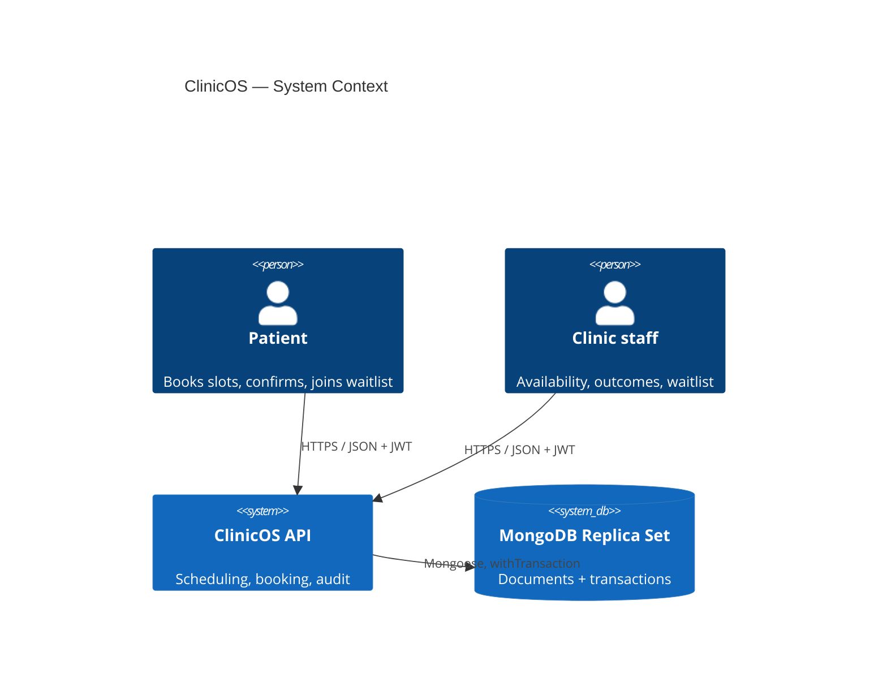

**Deliberate constraints:**

- No `slots` collection — slots are derived, not stored
- No per-second cron for hold expiry — lazy/event-driven cleanup via `holdLifecycle.service.js`
- Tenant isolation via `clinicId` on every document and JWT middleware

---

## Layered architecture

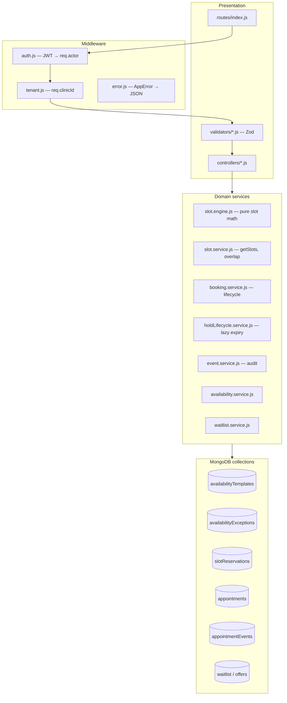

| Layer | Responsibility | Concurrency |
|-------|----------------|-------------|
| Controllers | HTTP in/out | No |
| `slot.service` | Load data, call engine, overlap **reads** | Pre-check only |
| `booking.service` | Writes + transactions | **Yes** — txn + unique index + CAS |
| `holdLifecycle` | Expire stale holds | Idempotent updates |
| `slot.engine` | Pure computation | No I/O |

---

## Request pipeline

Every protected route follows this path:

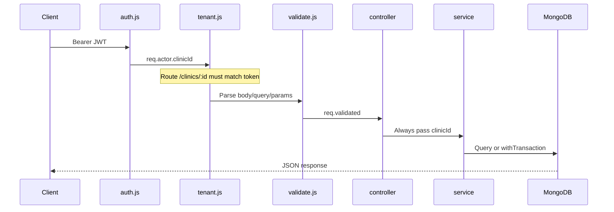

**Public routes (no JWT):** `GET /health`, `POST /clinics`, `POST /auth/signup`, `POST /auth/login`

---

## Data model

### Entity relationship

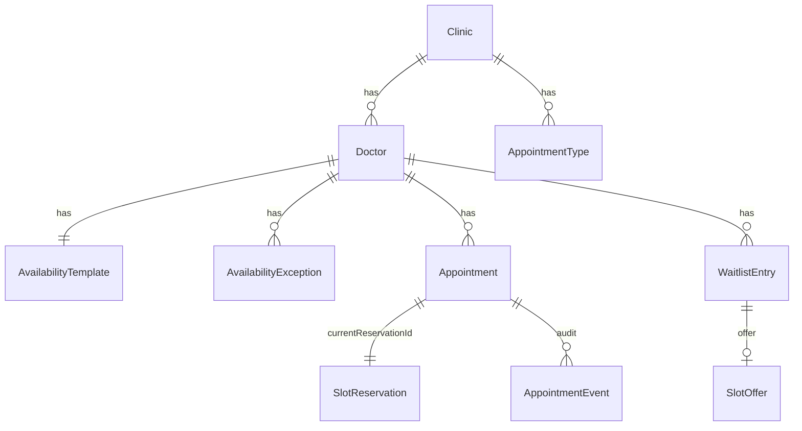

### Two parallel truths

| Concept | Collection | Mutable? | Purpose |
|---------|------------|----------|---------|
| **Lock** | `slotReservations` | Yes | Prevents double-booking |
| **Booking** | `appointments` | Yes | API read model (`version` for CAS) |
| **Audit** | `appointmentEvents` | **Append-only** | Compliance trail |

### Example documents

**AvailabilityTemplate**

```json
{
  "_id": "tpl_abc",
  "clinicId": "clinic_1",
  "doctorId": "dr_1",
  "weeklyTemplate": {
    "MON": [{ "start": "09:00", "end": "13:00" }, { "start": "15:00", "end": "18:00" }],
    "TUE": [{ "start": "10:00", "end": "17:00" }]
  },
  "isActive": true,
  "version": 1
}
```

**AvailabilityException**

```json
{
  "clinicId": "clinic_1",
  "doctorId": "dr_1",
  "date": "2025-06-10",
  "type": "block"
}
```

Types: `block` (no slots), `override` (replace template for that date), `additional` (extra windows on top of template).

**SlotReservation** (the lock — not a pre-built slot)

```json
{
  "_id": "res_xyz",
  "clinicId": "clinic_1",
  "doctorId": "dr_1",
  "appointmentId": "appt_01",
  "slotStart": "2025-06-10T03:30:00.000Z",
  "slotEnd": "2025-06-10T03:45:00.000Z",
  "status": "held",
  "holdExpiresAt": "2025-06-10T03:35:00.000Z"
}
```

**Appointment**

```json
{
  "_id": "appt_01",
  "clinicId": "clinic_1",
  "doctorId": "dr_1",
  "status": "pending",
  "version": 2,
  "currentReservationId": "res_xyz",
  "currentSlotStart": "2025-06-10T03:30:00.000Z",
  "durationMinutes": 15,
  "patient": { "name": "Jane", "phone": "+91..." }
}
```

**AppointmentEvent** (immutable)

```json
{
  "appointmentId": "appt_01",
  "clinicId": "clinic_1",
  "eventType": "created",
  "previousState": null,
  "newState": "pending",
  "actor": { "id": "patient_1", "role": "patient" },
  "timestamp": "2025-06-10T03:30:00.000Z"
}
```

### Embed vs reference

| Data | Choice | Why |
|------|--------|-----|
| `patient` on appointment | Embed | Snapshot at booking; no separate patient service |
| `appointmentTypeName`, `durationMinutes` | Embed | Historical accuracy if type changes |
| `slotReservation` | Separate collection | Lock lifecycle + unique index per slot |
| `appointmentEvents` | Separate collection | Append-only audit; never update/delete |

---

## Slot derivation engine

### GET /slots flow

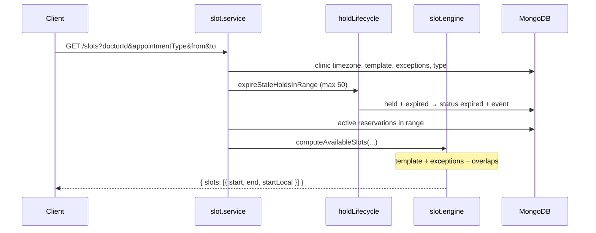

### Exception precedence (per local date)

| Priority | `type` | Effective windows |
|----------|--------|-------------------|
| 1 | `block` | None |
| 2 | `override` | Exception windows only |
| 3 | `additional` | Template + exception windows |
| 4 | (none) | Template for weekday |

Implemented in `src/services/slot.engine.js` → `effectiveWindowsForDate()`.

### Algorithm

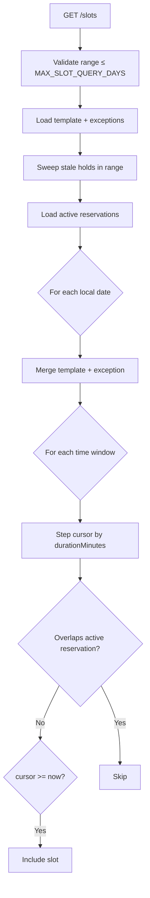

**Active reservation** (`slot.service.js`):

```
status = confirmed
OR (status = held AND holdExpiresAt > now)
```

**Overlap** (interval intersection — supports mixed durations):

```
reservation.slotStart < candidateEnd AND reservation.slotEnd > candidateStart
```

**Performance:** Reservations are sorted once, and overlap checks use an advancing pointer plus bounded forward scan in `slot.engine.js` (`hasOverlap`). This avoids a full `reservations.some()` from index 0 for every candidate slot and improves dense schedules while keeping correctness identical.

---

## Booking and concurrency

### POST /appointments — step trace

| Step | Location | Action |
|------|----------|--------|
| 1 | `booking.service` | Idempotency: `clinicId + idempotencyKey` → 200 if exists |
| 2 | | Validate future slot, doctor supports type |
| 3 | `slot.service` | `assertNoActiveReservationOverlap` |
| 4 | | `assertGeneratedSlot` (slot must exist on grid) |
| 5 | Transaction | `INSERT slotReservation` — `held`, `holdExpiresAt = now + 5m` |
| 6 | | `INSERT appointment` — `pending` |
| 7 | | `INSERT appointmentEvent` — `created` |
| 8 | On `E11000` | `expireHoldBySlot` → retry once OR **409** |

### Race: two patients, same slot

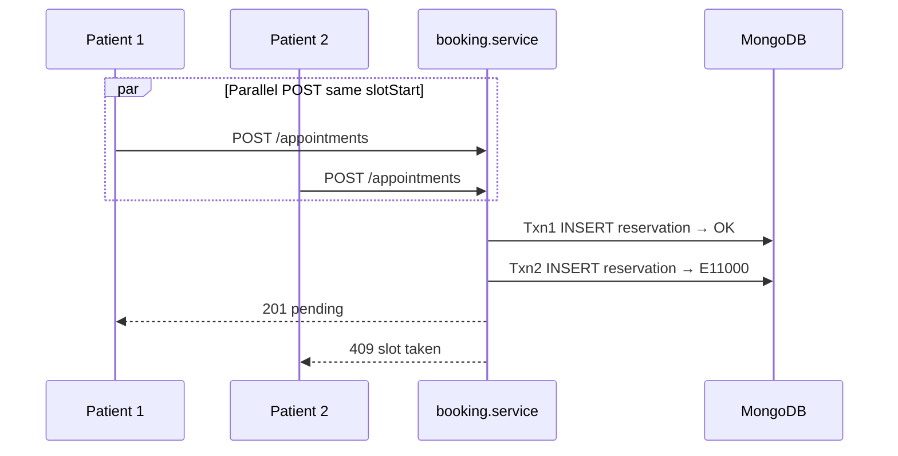

**Partial unique index** on `slotReservations`:

```javascript
{ clinicId: 1, doctorId: 1, slotStart: 1 }
// unique WHERE status IN ['held', 'confirmed']
```

### PATCH /confirm

| Step | Action |
|------|--------|
| Pre | Reservation `held` AND `holdExpiresAt > now` |
| Fail | `expirePendingHold` → **410 Gone** |
| Txn | CAS appointment `{ pending, version: N }` → confirmed |
| Txn | Reservation `held` → `confirmed`, unset `holdExpiresAt` |
| Txn | Event `confirmed` |

### PATCH /appointments/:id (reschedule) — CAS

| Step | Inside transaction |
|------|-------------------|
| 1 | Read appointment |
| 2 | **Claim:** `findOneAndUpdate { version: N }` → `$inc version` |
| 3 | Create new reservation at new slot |
| 4 | Update appointment slot fields |
| 5 | Release old reservation → `released` |
| 6 | Event `rescheduled` |

Concurrent reschedule loser: **409** `Appointment was already updated`.

### Double-booking demo

```bash
# After seed — pick slotStart from GET /slots
export TOKEN="..." # from POST /auth/login
export SLOT="2025-06-15T09:00:00.000Z"

for i in 1 2; do
  curl -s -o /dev/null -w "%{http_code}\n" -X POST http://localhost:3000/appointments \
    -H "Authorization: Bearer $TOKEN" -H "Content-Type: application/json" \
    -d "{\"doctorId\":\"...\",\"appointmentTypeId\":\"...\",\"slotStart\":\"$SLOT\",\"patientId\":\"p$i\",\"idempotencyKey\":\"demo-$i\"}" &
done
wait
# Expect: one 201, one 409
```

Or run: `tests/booking.concurrency.test.js` (20 parallel requests).

---

## Hold lifecycle (5-minute TTL)

Pending bookings hold a slot for **5 minutes** (`PENDING_HOLD_MINUTES`) while the patient completes checkout. After TTL, the slot must be bookable again **without a cron job**.

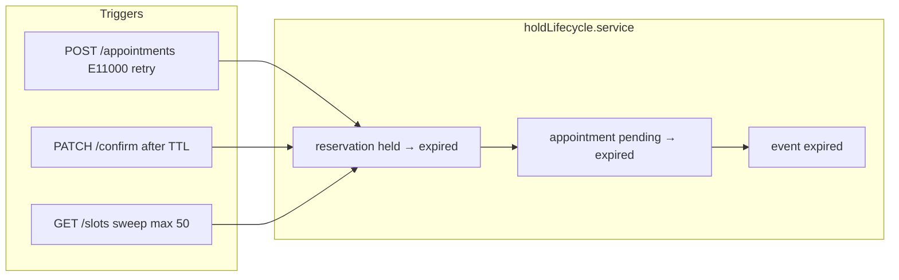

| Trigger | Function |
|---------|----------|
| Rebook hits duplicate key on stale hold | `expireHoldBySlot` |
| Confirm after TTL | `expirePendingHold` then 410 |
| Browse slots | `expireStaleHoldsInRange` |

`/slots` already **ignores** expired holds in queries; hold lifecycle **aligns DB state** with that behaviour.

---

## State machines

### SlotReservation

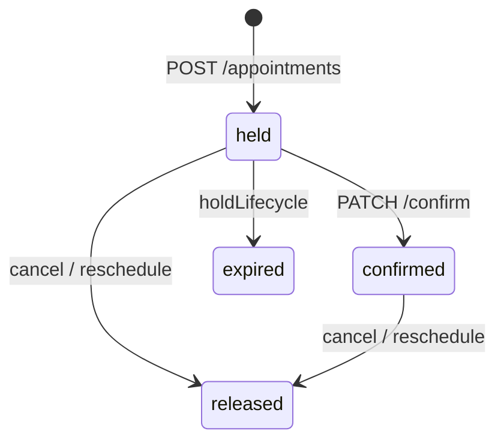

### Appointment

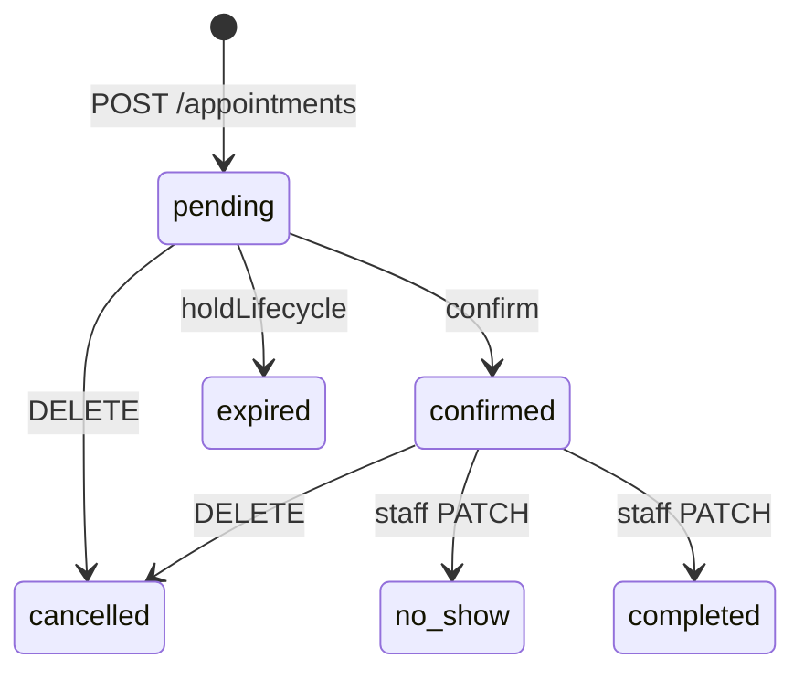

---

## Waitlist engine

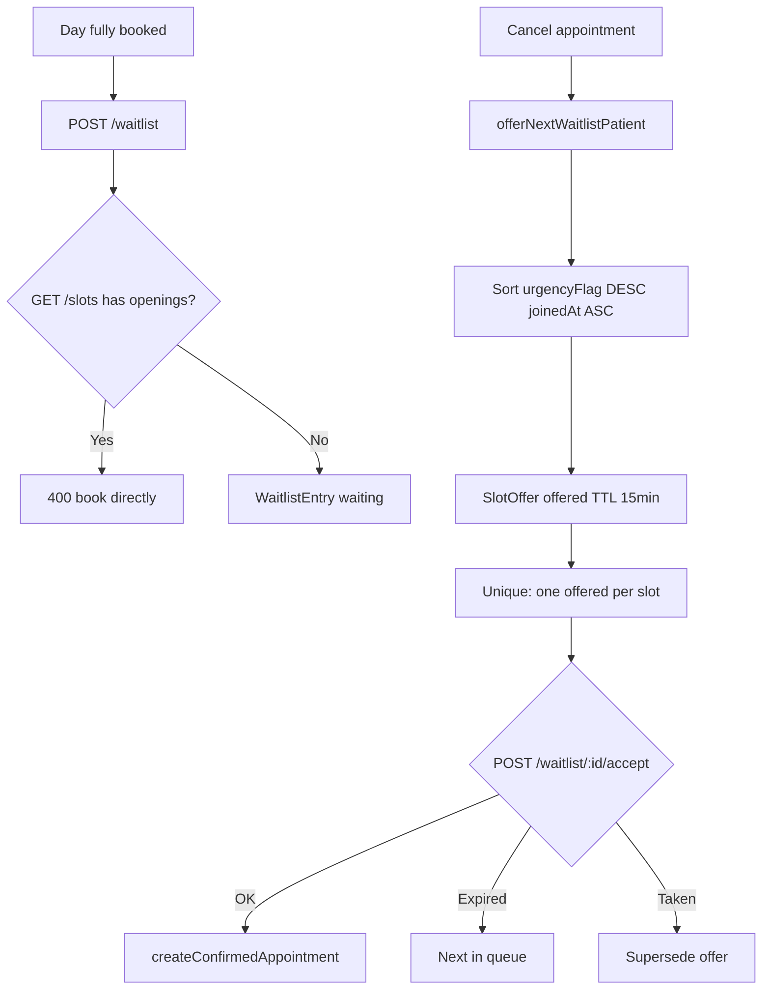

---

## Availability dry-run

`POST /doctors/:id/availability/validate`

- Input: proposed `weeklyTemplate` + date range (max 90 days)
- Loads **confirmed** appointments in range
- Returns appointments that would fall outside new windows
- **Does not persist** the template change

Response shape: `{ conflictCount, conflicts: [{ appointmentId, slotStart, patientName, appointmentType }] }`

---

## Multi-tenancy

**Strategy:** Shared database, shared collections, **`clinicId` on every tenant document**.

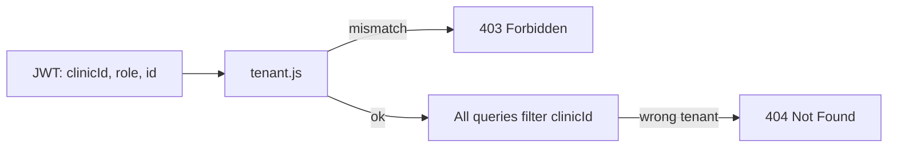

**Unsafe:**

```javascript
Appointment.findById(appointmentId);
```

**Safe:**

```javascript
Appointment.findOne({ _id: appointmentId, clinicId: req.clinicId });
```

Cross-clinic access returns **404** (not 403) to avoid leaking resource existence.

**Scaling to ~500 clinics:** Indexes must lead with `clinicId`. All tenants share collections; isolation is application-enforced. At very large scale, consider database-per-tenant for enterprise customers.

Tests: `tests/multi-tenancy.test.js`, `tests/auth.test.js`

---

## Design memos (Part 2)

### 2.1 Data model — why this shape?

- **Templates + exceptions** capture recurring and one-off schedule changes without regenerating slot rows.
- **`slotReservations`** are locks with a lifecycle, not calendar slots.
- **`appointments`** are the mutable read model patients and staff interact with.
- **`appointmentEvents`** provide an immutable audit trail required for compliance.

**If starting over:** Pre-parse reservation intervals and use a single-pass interval scan in `slot.engine.js` for better 30-day query performance on busy doctors.

### 2.2 Concurrency strategy (350–450 words)

Double-booking is prevented by **three cooperating layers** that each catch a different failure mode.
Together they provide user-facing determinism (`201` winner, `409` loser) while preserving an audit-safe write model under race conditions.

1. **Application overlap check** — before any write, `assertNoActiveReservationOverlap` queries `slotReservations` with interval logic (`slotStart < candidateEnd && slotEnd > candidateStart`) against active rows (`confirmed` or unexpired `held`). This blocks obvious conflicts early and returns a domain error instead of relying only on database exceptions.

2. **MongoDB transaction boundary** — write paths use `withTransaction(...)` so reservation changes, appointment projection changes, and `appointmentEvents` inserts commit together or roll back together. This is critical for audit consistency: we never want “appointment updated without event” or the inverse. It requires replica-set mode even in local dev.

3. **Database-enforced atomic claim** — the hard anti-double-book guard is the partial unique index on `slotReservations`:
`{ clinicId: 1, doctorId: 1, slotStart: 1 }` with filter `status ∈ { held, confirmed }`.
The exact winning atomic operation is `SlotReservation.create(...)` inside the booking transaction. If two requests race for the same `slotStart`, one insert commits; the loser gets MongoDB `E11000` duplicate key.

**What the loser sees:** `E11000` is translated to HTTP **409** with stable code `SLOT_TAKEN`. For optimistic-lock misses (`version` claim failed on confirm/cancel/reschedule), we return **409** with `VERSION_CONFLICT`. Client action is deterministic: refresh `/slots` or re-fetch appointment and retry.

**Pending → expired without tight polling:** there is no every-second cron. Expiry is lazy/event-driven via `holdLifecycle.service.js`: (a) confirm on stale hold triggers `expirePendingHold` and returns **410** `HOLD_EXPIRED`; (b) booking collision on an expired hold runs `expireHoldBySlot` then retries once; (c) `GET /slots` runs a bounded stale-hold sweep (50 rows max). This keeps cleanup proportional to user traffic.

**At 10,000 vs 100 concurrent requests:** correctness remains intact because the unique index serialises conflicting writes for an exact slot. What changes is contention profile: hot slots produce more lock/index contention, higher p95 latency, and more 409 retries. MongoDB helps with single-document atomicity and unique constraints, but it does not provide SQL-style row locks or exclusion constraints for arbitrary intervals, so we accept retry-heavy behavior under hotspot traffic as a deliberate NoSQL tradeoff.

**Proof:** `tests/booking.concurrency.test.js`, `tests/appointment-transitions.concurrency.test.js`

### 2.3 Multi-tenancy

- **Model:** `clinicId` field on every document; JWT embeds tenant context.
- **Enforcement:** `tenant.js` middleware + mandatory `clinicId` in service queries.
- **Before/after:** See [Multi-tenancy](#multi-tenancy) section above.
- **500 clinics:** Shared collections are fine if indexes are tenant-prefixed; monitor index size and query plans on `clinicId`-leading indexes.

### 2.4 NoSQL tradeoffs (200–250 words)

**1. Interval scheduling without SQL range types**

In PostgreSQL, this problem can be modeled with range types and exclusion constraints (for example, “no overlapping intervals for the same doctor”), and enforced directly in the database. MongoDB has no native equivalent for interval exclusion across arbitrary start/end combinations. That means slot safety cannot be expressed as one declarative constraint. We compensate by combining: (a) application-side interval overlap checks, (b) a partial unique index for exact `slotStart` claims, and (c) transactional writes for reservation + appointment + event consistency. This works well for correctness, but it shifts complexity into service code (`slot.engine.js`, `slot.service.js`, `booking.service.js`) and increases retry/error handling under contention. **Accepted tradeoff:** more application logic and conflict retries in exchange for flexible document modeling and simple tenant-scoped scaling.

**2. Mutable state + audit trail**

Relational systems can centralize audit guarantees with triggers, temporal tables, and foreign-key enforcement between projection and history tables. In this NoSQL implementation, `appointments` are mutable read models while `appointmentEvents` are append-only documents written by service code. MongoDB will not enforce “every appointment mutation must emit exactly one event” by itself; we enforce that discipline in transaction-aware service methods. The mitigation is explicit: all transition endpoints call `writeEvent(...)` inside the same `withTransaction(...)` block, and event documents have no update/delete code paths. We also added replay/reconcile helpers (`deriveAppointmentFromEvents`, `reconcileAppointment`) to spot projection drift. **Accepted tradeoff:** audit correctness depends on code-path discipline and test coverage rather than a fully declarative database contract.

### 2.5 Waitlist race condition (stretch note)

Waitlist introduces a second concurrency hotspot beyond booking: multiple cancellation or queue-advance paths can try to issue an offer for the same slot at nearly the same time. We handle this with a partial unique index on `slotOffers` for active offers (`status: offered`) keyed by `{ clinicId, doctorId, appointmentTypeId, slotStart }`. If a concurrent offer attempt loses, MongoDB returns `E11000` and we drop that offer path safely. A related race exists on accept: an offered patient may click accept while the slot is taken through another path. `acceptOffer` books through `createConfirmedAppointment`, so reservation uniqueness still arbitrates the winner. Losers receive `409 SLOT_TAKEN`, and the queue advances via supersede/expire handlers.

---

## Error and HTTP matrix

Responses use `{ error: { code, message, details? } }`. Codes are defined in `src/utils/errors.js` (`ErrorCodes`).

| HTTP | Code | When |
|------|------|------|
| 200 | — | Success; idempotent booking replay |
| 201 | — | New booking created |
| 400 | `BAD_REQUEST` | Invalid input, wrong state, slot off-grid |
| 401 | `UNAUTHORIZED` | Missing or invalid JWT |
| 403 | `FORBIDDEN` | Clinic mismatch, waitlist ownership |
| 404 | `NOT_FOUND` | Resource not found in tenant |
| 409 | `CONFLICT` | Generic conflict (e.g. duplicate waitlist) |
| 409 | `SLOT_TAKEN` | Active reservation or unique index on `slotStart` |
| 409 | `VERSION_CONFLICT` | Optimistic lock lost (confirm, cancel, reschedule) |
| 409 | `DUPLICATE_KEY` | Unhandled MongoDB `E11000` (middleware fallback) |
| 410 | `GONE` | Generic gone |
| 410 | `HOLD_EXPIRED` | Pending hold past TTL on confirm |
| 410 | `OFFER_EXPIRED` | Waitlist slot offer past expiry |
| 500 | `INTERNAL_SERVER_ERROR` | Unhandled error |

**Client hints:** On `SLOT_TAKEN`, refresh `GET /slots` and retry. On `HOLD_EXPIRED`, start a new booking. On `VERSION_CONFLICT`, re-fetch the appointment and retry the transition.

---

## Indexes

Run `npm run setup:indexes` after schema changes.

| Collection | Index | Serves |
|------------|-------|--------|
| `slotReservations` | `{ clinicId, doctorId, slotStart }` unique partial active | Anti double-book |
| `slotReservations` | `{ clinicId, doctorId, status, slotStart, slotEnd }` | Overlap + `/slots` range |
| `slotReservations` | `{ clinicId, status, holdExpiresAt }` | Stale hold sweep |
| `appointments` | `{ clinicId, idempotencyKey }` unique sparse | Idempotent POST |
| `appointments` | `{ clinicId, doctorId, status, currentSlotStart }` | List by doctor/date |
| `appointmentEvents` | `{ appointmentId, timestamp }` | History |
| `slotOffers` | `{ clinicId, doctorId, appointmentTypeId, slotStart }` unique partial offered | One offer per slot |
| `waitlistEntries` | urgency + joinedAt | Queue ordering |

---

## API overview

| Method | Path | Purpose |
|--------|------|---------|
| GET | `/health` | Health check |
| POST | `/auth/signup`, `/auth/login` | JWT auth |
| PUT | `/doctors/:id/availability` | Weekly template |
| POST | `/doctors/:id/exceptions` | Date exception |
| POST | `/doctors/:id/availability/validate` | Dry-run schedule change |
| GET | `/slots` | Available slots (derived) |
| POST | `/appointments` | Book (pending hold) |
| PATCH | `/appointments/:id/confirm` | Confirm within TTL |
| PATCH | `/appointments/:id` | Reschedule |
| DELETE | `/appointments/:id` | Cancel |
| PATCH | `/appointments/:id/noshow`, `/complete` | Staff outcomes |
| GET | `/appointments/:id/history` | Audit trail |
| POST | `/waitlist` | Join waitlist |
| POST | `/waitlist/:id/accept` | Accept offer |

Full contract: `openapi/openapi.yaml` · Postman: `postman/ClinicOS_postman_collection.json`

---

## Testing

```bash
npm test
```

| Test file | Proves |
|-----------|--------|
| `tests/booking.concurrency.test.js` | 20 parallel → 1 winner |
| `tests/appointment-transitions.concurrency.test.js` | Confirm/cancel/reschedule races |
| `tests/slots.api.test.js` | Slot derivation, hold sweep |
| `tests/multi-tenancy.test.js` | Tenant isolation |
| `tests/events.test.js` | Audit trail |
| `tests/waitlist.test.js` | Waitlist flow |

With server running: `npm run e2e:curl`

---

## Environment variables

| Variable | Default | Purpose |
|----------|---------|---------|
| `PORT` | `3000` | HTTP port |
| `MONGODB_URI` | local replica set | Mongo connection |
| `JWT_SECRET` | `dev-secret` | Token signing |
| `JWT_EXPIRES_IN` | `7d` | Token TTL |
| `NODE_ENV` | `development` | Environment |
| `MAX_SLOT_QUERY_DAYS` | `30` | Max `/slots` range |
| `PENDING_HOLD_MINUTES` | `5` | Booking hold TTL |
| `WAITLIST_OFFER_MINUTES` | `15` | Waitlist offer TTL |

See `.env.example` for a template.

---

## File map

| File | Role |
|------|------|
| `src/services/slot.engine.js` | Pure slot generation from template + exceptions |
| `src/services/slot.service.js` | `getSlots`, overlap checks, `assertGeneratedSlot` |
| `src/services/booking.service.js` | Book, confirm, cancel, reschedule, outcomes |
| `src/services/holdLifecycle.service.js` | Lazy hold expiry |
| `src/services/event.service.js` | Append-only audit writes |
| `src/services/availability.service.js` | Templates, exceptions, validate |
| `src/services/waitlist.service.js` | Queue, offers, accept |
| `src/utils/transactions.js` | MongoDB session wrapper |
| `src/middleware/tenant.js` | Tenant guard |
| `src/middleware/auth.js` | JWT verification |
| `scripts/seed.js` | Demo data |
| `scripts/setup-indexes.js` | Index sync |

---

## AI tools disclosure

AI tooling (Cursor + LLM assistance) was used for implementation acceleration, test scaffolding, and documentation drafting. Specifically, AI helped generate route/service boilerplate, initial test structures, and wording for architecture and memo sections. All critical domain logic (slot derivation rules, concurrency guarantees, transaction boundaries, and tenant enforcement) was manually reviewed and validated against integration tests before submission. Final acceptance criteria were verified by running the test suite, checking API behavior through Swagger/Postman, and manually confirming the concurrent booking loser path.

---

## Diagram export

Mermaid diagrams in this README render on GitHub and in VS Code (Mermaid extension). To export as PNG/SVG for slides:

1. Copy a diagram block into https://mermaid.live  
2. Export image  
3. Optional: commit under `docs/diagrams/` and link from here

---

## Licence

Private / assessment project — see repository owner for terms.
